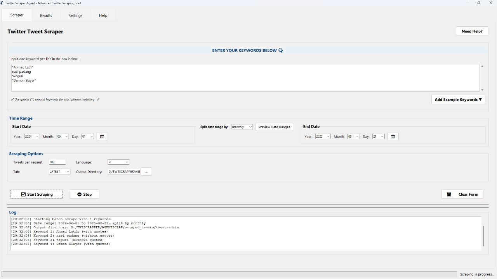

# Twitter Scraper Agent

A powerful GUI application for automating Twitter scraping with flexible configuration options. This tool is built on top of and extends the functionality of [tweet-harvest](https://github.com/helmisatria/tweet-harvest) by Helmi Satria.

> **Important Disclaimer**: This application is provided strictly for academic and educational research purposes. The usage of this tool should comply with Twitter's Terms of Service. Twitter requires authentication for search functionality, which is why this tool requires a valid auth_token from an authenticated session. Users are responsible for ensuring their usage of this tool adheres to all applicable laws and platform policies.

## Features

- **Flexible Date Ranges**: Scrape tweets from any time period with precise date control
- **Customizable Intervals**: Split your date range by year, quarter, month, week, or day
- **Multiple Keywords**: Process multiple search terms in a single batch
- **Exact or Flexible Matching**: Use quotes for exact phrases or without for broader results
- **Secure Configuration**: Auth token stored securely in a local .env file
- **Detailed Results**: Track success rates, file locations, and tweet counts

## Screenshots



## Requirements

- Python 3.8 or higher
- Node.js and npm (for tweet-harvest)
- Twitter auth token

## Installation

1. Make sure you have Python installed
2. Install Node.js from https://nodejs.org/
3. Install required Python packages:

```
pip install -r requirements.txt
```

## Usage

1. Run `launch.bat` to start the application
2. In the Settings tab:
   - Obtain your Twitter auth token from x.com cookies (see "Getting Your Auth Token" section below)
   - Paste the auth_token value in the text field
   - Click "Save Token" to securely store it
3. In the Scraper tab:
   - Enter keywords (one per line)
   - Set your precise date range
   - Choose how to split the date range (yearly, quarterly, monthly, weekly, daily)
   - Configure additional options
   - Click "Start Scraping"
4. View results in the Results tab

## User Interface Guide

### Main Scraper Tab
1. **Keywords Section**:
   - Enter one keyword per line
   - Use quotes around phrases for exact matching (e.g., "Universitas Indonesia")
   - Click "Add Examples" to see and add common keyword types
   
2. **Time Range Section**:
   - Set precise start and end dates (year, month, day)
   - Choose how to split the date range (monthly, yearly, etc.)
   - Use "Preview Date Ranges" to see how your date range will be divided
   
3. **Scraping Options**:
   - Set tweets per request limit
   - Choose language and tab (LATEST or TOP)
   - Results will be saved directly to the 'scraped_tweets' folder

### Results Tab
- View summary of scraping jobs
- Browse and open scraped files
- Export results summary

### Settings Tab
- Enter and save your Twitter auth token (obtained from x.com cookies as described in "Getting Your Auth Token" section)
- You can paste the auth_token value directly in the text field (it should look like a long string of characters)
- Click "Save Token" to securely store it in the .env file
- Configure default output directory
- Check Node.js installation status

## File Organization

- All scraped tweets are saved directly in the `scraped_tweets` folder
- Files are named with pattern `keyword_startdate_to_enddate.csv`
- All files are consolidated in the main folder for easier access
- The application automatically handles any nested files created by the scraping tool
- If files appear in a `tweets-data` subfolder, they are automatically moved to the main folder

## Keywords Guide

### Without Quotes (Flexible Search)
- Single words: gibran, jokowi, prabowo
- Hashtags: #pilpres2024, #debatcapres
- Multiple keywords: gibran rakabuming (finds tweets with both words)
- Better for: broad searches, variations, typos

### With Quotes (Exact Phrase)
- Exact phrases: "Gibran Rakabuming Raka"
- Institution names: "Universitas Indonesia"
- Specific terms: "Presiden Jokowi"
- Better for: precise searches, official names

## Getting Your Auth Token

1. Log in to Twitter (x.com) in your browser
2. Press F12 or right-click and select "Inspect" to open developer tools
3. Go to the "Application" tab in developer tools (you may need to click the >> arrows to see this tab)
4. In the left sidebar, under "Storage", expand "Cookies" and click on "x.com" or "twitter.com"
5. In the cookies list, search for "auth_token" (you can use Ctrl+F or the filter box)
6. Copy the value of the auth_token cookie (it will look like a long string of characters, e.g., `20xef7xxx017129d57148xxxb87d0dxxxfbf`)
7. Paste this value in the Settings tab of the application and click "Save Token"

Note: The auth_token is sensitive information. The application stores it securely in a local .env file that should not be shared.
